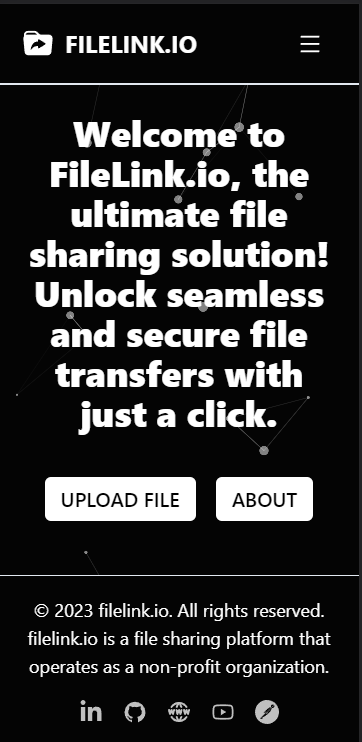
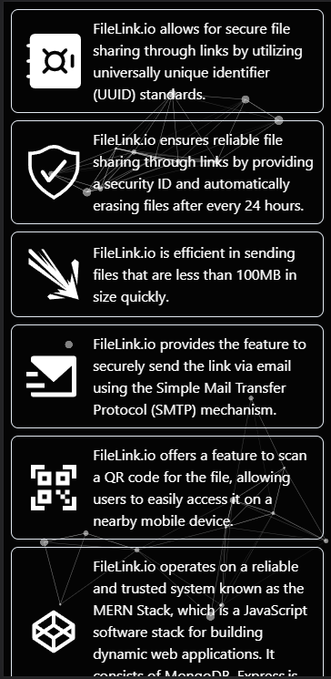
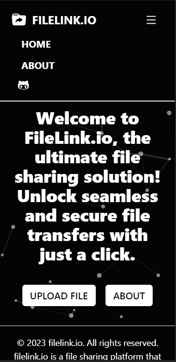
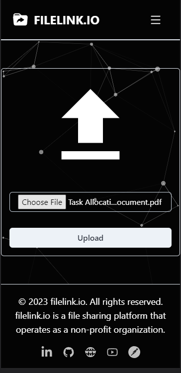
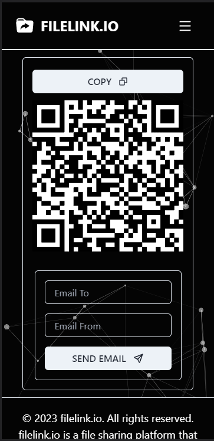
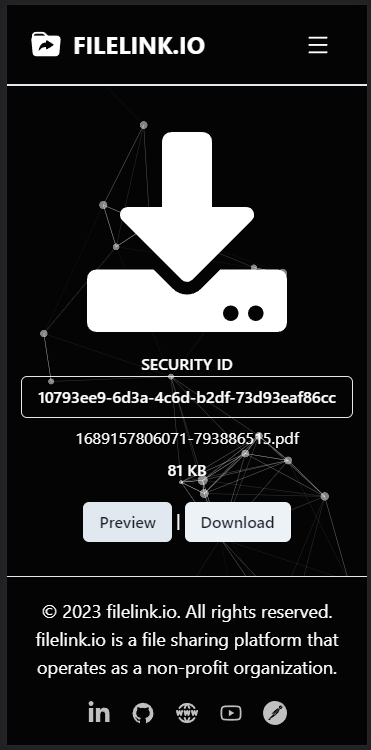
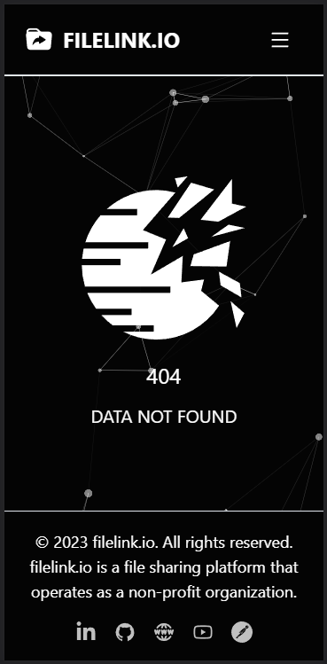

# Filelink.io 
## CodeClause Golden Project

Filelink.io is a professional and user-friendly file sharing application that allows users to securely share files through unique links. The project is built using the MERN (MongoDB, Express.js, React.js, Node.js) stack, ensuring a robust and efficient backend.

  

## Features

- **Secure and Reliable**: Filelink.io prioritizes the security and reliability of user data, ensuring a safe and seamless file sharing experience.
- **Fast Service**: The MERN stack empowers Filelink.io with fast and responsive file uploads, downloads, and sharing operations.
- **Error Handling**: The backend incorporates three main error-handled routes to enhance stability and handle potential issues:
  - `/api/upload`: Enables file uploads to the MongoDB database using Multer for efficient file handling.
  - `/download/:uuid`: Retrieves files using a unique identifier (UUID) from MongoDB and delivers them to the client.
  - `/api/upload/send`: Facilitates sending download links via email, utilizing the BRIVO SMTP service.

## Technologies Used

- **Backend**: Node.js, Express.js, MongoDB, Multer, BRIVO SMTP service.
- **Frontend**: React.js, TailwindCSS, Partical.js, Axios, react-router-dom.

## Installation

1. Clone the repository.
2. Navigate to the project directory.
3. Install backend dependencies: `npm install`.
4. Install frontend dependencies: `cd client && npm install`.
5. Start the backend server: `npm run server`.
6. Start the frontend development server: `cd client && npm start`.

## Configuration

- Backend:
  - Configure the MongoDB connection in `config/db.js`.
  - Set up the BRIVO SMTP service credentials in `config/email.js`.
- Frontend:
  - Update the API endpoint URLs in `client/src/config.js`.

## Usage

1. Access the application at `http://localhost:3000`.
2. Upload files through the `/api/upload` route.
3. Download files using unique URLs at `/download/:uuid`.
4. Send download links via email using the `/api/upload/send` route.

## Postman API Documentation

For detailed API documentation and examples, please refer to our [Postman API Documentation](https://documenter.getpostman.com/view/23026707/2s946chEvE).

## Credits

- This project was created by Aditya Battin.
- Filelink.io logo designed by Aditya Battin.

## License

This project is licensed under the ISC VS CODE LICENSE.

## Screenshots

  
  

  <em>Home Page                  .</em>
  <em>.               Features Page</em>

  
  

  <em>Navbar Featues               .</em>
  <em>.                  Upload Page</em>

  
  

  <em>Share Link Page               .</em>
  <em>.             Download File Page</em>

  

  <em>File not found page</em>

